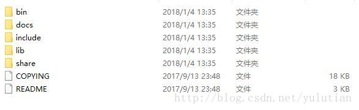

# Window 安装 MYSQL5.7 压缩版

    Windows 64 位 mysql 5.7以上版本包解压中没有data目录和my-default.ini和my.ini文件以及服务无法启动的解决办法以及修改初始密码的方法


    本来以为开源的安装很简单，但是中间出现了一些问题，记录下来，希望能帮助到他人。

mysql官网下载地址：https://dev.mysql.com/downloads/mysql/点击打开链接

以5.7.20版本为例

1. 首先安装包解压后，没有网上教程里面提到的data文件夹和my-default.ini，如下图所示




2. 配置环境变量请参照网上教程，这个一般没有问题，即在环境变量中Path中加入MYSQL解压包bin所在路径，我的是：

D:\softnew\MYSQL\mysql-5.7.20-winx64\bin

主要注意以下几点：

（1）my-default.ini文件存不存在不重要，关键需要自己在根目录下新建一个my.ini文件，具体内容如下：

```shell
[mysql]
# 设置mysql客户端默认字符集
default-character-set=utf8 
[mysqld]
#设置3306端口
port = 3306 
# 设置mysql的安装目录
basedir=D:\\softnew\\MYSQL\\mysql-5.7.20-winx64
# 允许最大连接数
max_connections=200
# 服务端使用的字符集默认为8比特编码的latin1字符集
character-set-server=utf8
# 创建新表时将使用的默认存储引擎
default-storage-engine=INNODB

```

可以直接复制粘贴，主要修改下basedir后的路径，注意路径中为\\而非\

（2）请不要自己创建data文件夹

网上很多教程建议自己新建一个空data文件夹，再在my.ini文件中增加一句：

# 设置mysql数据库的数据的存放目录
datadir=D:\\softnew\\MYSQL\\mysql-5.7.20-winx64\\data

这样会导致服务无法启动，不要添加这一句，也不要自己新建data文件夹，由mysql自动生成data就好，具体来说：

1）以管理员的方式打开cmd命令窗口（直接打开cmd运行，可能会报错），并且进入到mysql安装目录的bin目录下。然后输入命令mysqld install     显示成功

2）再输入：mysqld --initialize      此时应该没有任何提示

 

3）再输入：net start mysql     显示


最后data文件夹里面的内容应该显示为：


另注：第一次登陆MYSQL时，会提示要求输入初始密码，这是考虑安全因素，命令：mysqld --initialize会随机生成密码。

初始密码在上图data文件夹下的xxx.err文件中，可以用记事本打开，用ctrl+f 查找功能找到如下一行记录：

[Note] A temporary password is generated for root@localhost: NZ+uhXPq1zN.

其中NZ+uhXPq1zN.即为初始密码（注意.号不要漏了）

进入后可以用如下命令修改，这里密码改为root：

```sql

ALTER USER 'root'@'localhost' IDENTIFIED BY 'root';

```

这里是5.7.22版本，显示基本如下：


安装完成！
