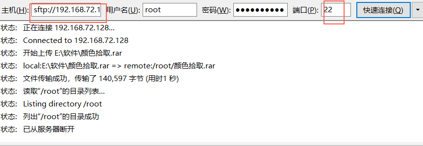
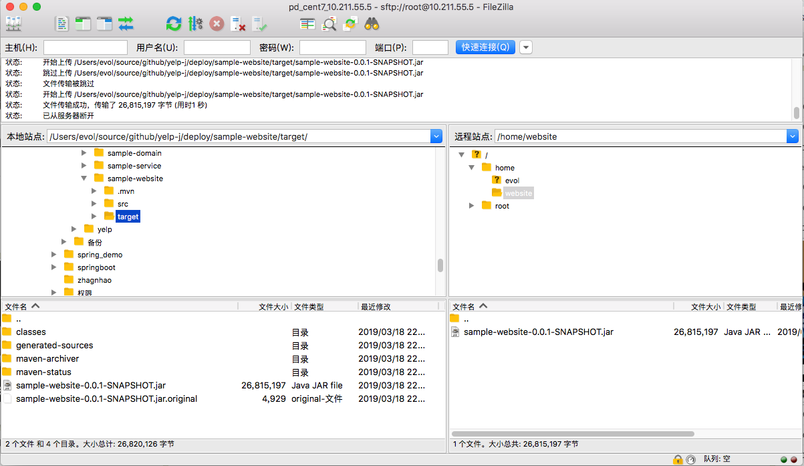

# Delpoy

## FTP

### vsftpd 服务端安装

操作系统： Centos

1  检查是否安装vsftpd

```shell
# rpm -qa | grep vsftpd
```

2  没有就安装vsftpd

```shell
# yum -y install vsftpd
```

3  设置开机启动

```shell
# chkconfig vsftpd on
```

4  修改配置

注释掉/etc/vsftpd/ftpusers文件中的root，因为这一行禁止root登录

然后启动vsftpd服务

```shell
# systemctl start vsftpd
```

5：连接vsftpd服务，选用的客户端是FileZilla

### 客户端安装

下载

https://www.filezilla.cn/download

以下介绍只是适用于用ftp在物理机和虚拟机之间传输文件使用的，不适合于生产环境做服务器使用。





## Maven命令打包

导航到项目pom.xml文件所在的目录，执行打包命令。

```shell
mvn clean package -Dmaven.test.skip=true
```
mvn 选项说明：

    -DskipTests，不执行测试用例，但编译测试用例类生成相应的class文件至target/test-classes下。

    -Dmaven.test.skip=true，不执行测试用例，也不编译测试用例类。


### 部署到linux

切换到 /home目录，并创建站点文件夹website

```shell
# mkdir website
# cd website/
```

使用FileZilla上床jar包到website 目录，使用java -jar xxxx.jar运行站点。

```shell
# cd website/
# ls
sample-website-0.0.1-SNAPSHOT.jar
# java -jar sample-website-0.0.1-SNAPSHOT.jar 


  .   ____          _            __ _ _
 /\\ / ___'_ __ _ _(_)_ __  __ _ \ \ \ \
( ( )\___ | '_ | '_| | '_ \/ _` | \ \ \ \
 \\/  ___)| |_)| | | | | || (_| |  ) ) ) )
  '  |____| .__|_| |_|_| |_\__, | / / / /
 =========|_|==============|___/=/_/_/_/
 :: Spring Boot ::       (v1.5.19.RELEASE)
 2019-03-18 22:57:04.130  INFO 6130 --- [           main] o.s.j.e.a.AnnotationMBeanExporter        : Registering beans for JMX exposure on startup
2019-03-18 22:57:04.163  INFO 6130 --- [           main] s.b.c.e.t.TomcatEmbeddedServletContainer : Tomcat started on port(s): 8080 (http)
2019-03-18 22:57:04.167  INFO 6130 --- [           main] c.evol.sample.SampleWebsiteApplication   : Started SampleWebsiteApplication in 4.964 seconds (JVM running for 5.532)
```

访问

```shell
# curl localhost:8080
<!DOCTYPE html>

<html lang="zh-CN">
<head>
    <meta charset="utf-8" />
    <meta http-equiv="X-UA-Compatible" content="IE=edge" />
    <title>Essingle | Log in</title>
</head>
<body>
<div>
    <p>1</p>
    <p>zhangsan</p>
    <p>zhangsan@qq.com</p>
</div>
</body>
</html>
```

或使用IP从外部访问，前提防火墙增加端口 或 关闭防火墙

```shell
# curl http://10.211.55.5:8080
<!DOCTYPE html>
<html lang="zh-CN">
<head>
    <meta charset="utf-8" />
    <meta http-equiv="X-UA-Compatible" content="IE=edge" />
    <title>Essingle | Log in</title>
</head>
<body>
<div>
    <p>1</p>
    <p>zhangsan</p>
    <p>zhangsan@qq.com</p>
</div>
</body>
</html>
```


### 部署到docker

### centos防火墙

CentOS 7.0默认使用的是firewall作为防火墙

1.查看防火墙状态

```shell
# firewall-cmd --state
```
2.停止firewall

```shell
# systemctl stop firewalld.service
```
3.禁止firewall开机启动

```shell
# systemctl disable firewalld.service
```

## Docker

### Guides  for Centos7+

#### 1. GET

Get Docker CE for Ubuntu  
https://docs.docker.com/install/linux/docker-ce/ubuntu/

Get Docker CE for CentOS    
https://docs.docker.com/install/linux/docker-ce/centos/

To install Docker CE, you need a maintained version of CentOS 7.

#### 2. Uninstall old versions

```shell
$ sudo yum remove docker docker-client docker-client-latest docker-common docker-latest docker-latest-logrotate docker-logrotate docker-engine
```

#### 3. Install using the repository

1. SET UP THE REPOSITORY

```shell
$ sudo yum install -y yum-utils device-mapper-persistent-data lvm2
```

2. 

```shell
$ sudo yum-config-manager --add-repo https://download.docker.com/linux/centos/docker-ce.repo
```

#### 4. INSTALL DOCKER CE

安装最新版
```shell
$ sudo yum install docker-ce docker-ce-cli containerd.io
```
列出所有docker有效版本

```shell
$ yum list docker-ce --showduplicates | sort -r
```

安装指定版本
```shell
$ sudo yum install docker-ce-<VERSION_STRING> docker-ce-cli-<VERSION_STRING> containerd.io
```


启动Docker
```shell
$ sudo systemctl start docker
```

验证docker安装，运行 'hellp-world' 镜像
```shell
$ sudo docker run hello-world
```


## Docker Issue

按照官方指南安装daocker，运行hello-world是报错，按照以下文章操作，并重启centos后，报错，运行成功；

Centos 7 如何卸载docker

https://blog.csdn.net/liujingqiu/article/details/74783780


## Centos 7

设置开机自动联网

修改ifcg-xxx文件，xxx代表centos有线网络的名称,替换这个xxx
（注：不是“ifcg-io”文件）

```shell
# vim /etc/sysconfig/network-scripts/ifcg-xxx
```
修改DNBOOT

```shell
DNBOOT=yes
```


 


