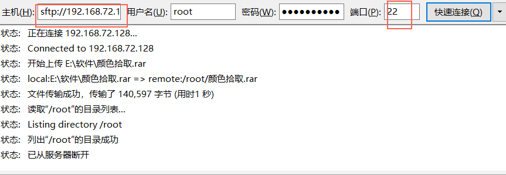

# Delpoy

## FTP

### vsftpd 服务端安装

操作系统： Centos

1  检查是否安装vsftpd

```shell
# rpm -qa | grep vsftpd
```

2  没有就安装vsftpd

```shell
# yum -y install vsftpd
```

3  设置开机启动

```shell
# chkconfig vsftpd on
```

4  修改配置

注释掉/etc/vsftpd/ftpusers文件中的root，因为这一行禁止root登录

然后启动vsftpd服务

```shell
# systemctl start vsftpd
```

5：连接vsftpd服务，选用的客户端是FileZilla

### 客户端安装

下载

https://www.filezilla.cn/download

以下介绍只是适用于用ftp在物理机和虚拟机之间传输文件使用的，不适合于生产环境做服务器使用。




## Maven命令打包

导航到项目pom.xml文件所在的目录，执行打包命令。

```shell
mvn clean package -Dmaven.test.skip=true
```
mvn 选项说明：

    -DskipTests，不执行测试用例，但编译测试用例类生成相应的class文件至target/test-classes下。

    -Dmaven.test.skip=true，不执行测试用例，也不编译测试用例类。


